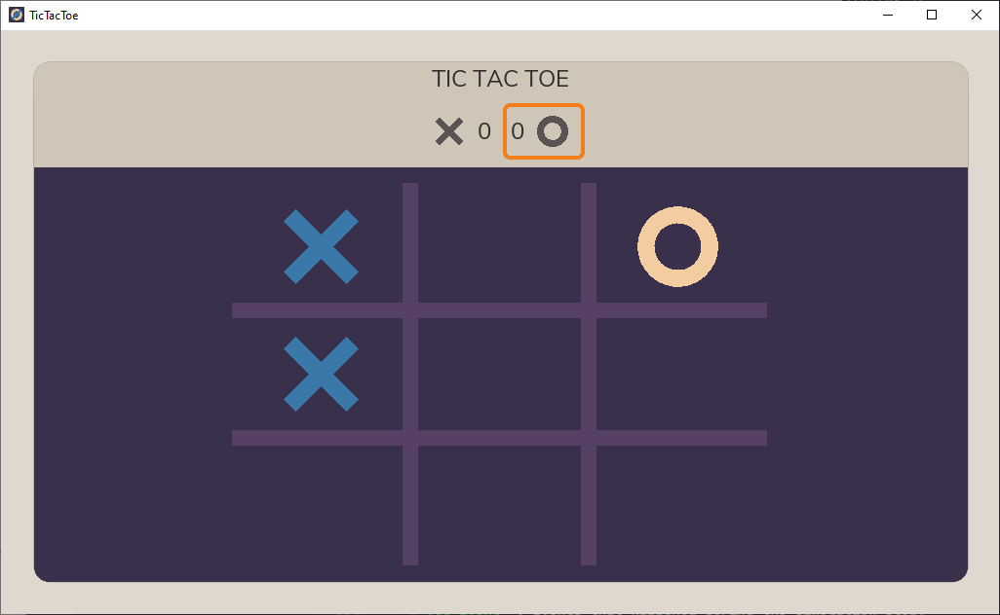

# Tic Tac Toe

A simple [tic-tac-toe](https://en.wikipedia.org/wiki/Tic-tac-toe) two player game for Windows, macOS and Linux, with simple graphics and sounds.



## Technical Features

- Made with  [Rust](https://www.rust-lang.org/) and  [Godot](https://godotengine.org/) using  [godot-rust](https://godot-rust.github.io/) bindings.
- Strict seperaration between game logic written in Rust and user interface in Godot, as explained in the [game architecture page](https://godot-rust.github.io/book/gdnative-overview/architecture.html#3-rust-game--godot-io-layer) of the [godot-rust book](https://godot-rust.github.io/book/).
- Deterministic game logic.
- Unit tests for the core gameplay part.
- CI that builds to Linux, macOS and Windows (MSVC) on every push to the main branch.
- Scripts that allow to install Godot and its export templates on Linux, macOS and Windows.
- Designed to be easily copy-pasted to bootstrap new projects.

## Development

### Organization

The code is split in 3 parts:

- `tictactoe`: a pure Rust library that hosts the core game logic.
- `tictactoe-gui`: the Godot project that defines all graphics, sounds and UI code, and generates the input actions.
- `tictactoe-godot`: a Rust library that provides glue code to link the Rust library and the Godot project together.

#### Library `tictactoe`

This is where all important gameplay code is located.

It has a single public function:

```rust
fn update(&mut self, delta: f64, actions: &[Action]) -> Vec<Event>
```

- `delta`: how long to advance the simulation.
- `actions`: actions that should be applied to the simulation.
- `-> Vec<Event>`: events that happened during the simulation step.

It is reasonably well unit tested and the build/run tests loop is very fast since the library has no external dependency.

- Actions can be `PlaceMark` or `Reset`.
- Events can be `GameStarted`, `GameEnded` or `MarkPlaced`.

#### Library `tictactoe-godot`

Its goal is to:

- Gather relevant input actions from Godot (left mouse clicks).
- Convert them in `Action` Rust enum values.
- Pass them to the simulation update of `tictactoe`.
- Collect returned `Event` Rust enum values and emit related Godot signals.

In order to determine where the player clicked when placing a mark, the `last_clicked_coordinates` property is called to the first child node. It is expected that Godot fills this property with the right coordinates according to which cell the player clicked.

#### Godot Project `tictactoe-gui`

Responsabilites:

- Render the user interface.
- Instantiate a game logic Node with the GDNative script attached to it and call the `_physics_process` function.
- Add a child to this Node with the `last_clicked_coordinates` property.
- Fill the `last_clicked_coordinates` property when left mouse clicks are detected in the grid.
- Connect the signals emitted by the game logic node to the relevant functions, so graphics and sounds react to game events.

### Building

The Godot project assumes the library is built according to the paths in [`tictactoe.gdnlib`](tictactoe-gui\src\tictactoe.gdnlib): `target/{target_name}/release/{library_file}`.

This means the Rust code should be built with the `--target` argument of `cargo`.

The easiest is to use the `cargo-make` configuration defined in [`Makefile.toml`](Makefile.toml):

```shell
# Needed the first time:
cargo install cargo-make
# Then build a release.
cargo make build-release
```

In order to export the game (which is what the CI [GitHub Actions workflow](.github/workflows/ci.yml) does):

```shell
cargo make export
```

This will:

- Run the tests.
- Build a release version of the libraries.
- Install Godot if not installed.
- Install Godot export templates if not installed.
- Export the OS version of the game.

## Credits

Sound assets from [Kenney Game Assets 3](https://kenney.itch.io/kenney-game-assets-3).
